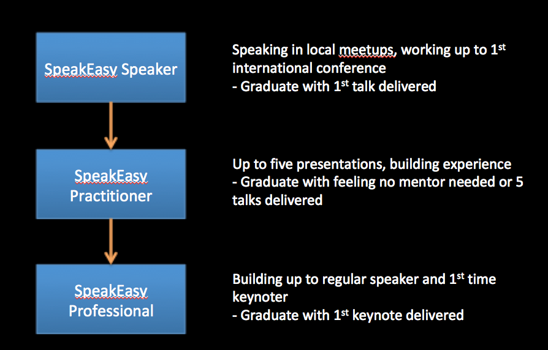

Looking at our available resources, we are experimenting with ways of finding the right way of supporting the speaker community in the growth TechVoices is set up for. This has lead us to have only two programs open for now:

   * **TechVoices Speaker** -program sets a newbie speaker up with a mentor to work their way to their 1st international conference. This is a continuous program, where we set subprograms for particular conferences to build whole tracks or experiment with new ways of helping conferences get new voices.

   * **TechVoices Keynote** -program sets new keynoters up for partner conference keynotes that have specific calls for keynoters. We have worked with Agile Testing Days USA 2019 and with Selenium Conference London 2019 on this program.

We realize that on top of the open programs, it helps us to talk about levels of speakers we seek to find different ways of supporting.

   * TechVoices Speakers graduate at their 1st international talk and after that are low in priorities in finding them an active mentor so that we can support new incoming speakers. This level matches our primary program.

   * TechVoices Practitioners graduate when they feel they are comfortable preparing talks, or as we have defined it, having delivered 5 talks. The number is quite arbitrary and some people feel comfortable as established practitioners after one on their own, while others feel they need help longer. This level does not have a program open now, which means we only seek to provide people on this level connections within the speaker community, and they need to actively seek feedback that helps them grow without our pairing.

   * TechVoices Professionals graduate at a keynote delivery. This level says we want to serve people who are very comfortable speaking (and brilliant mentors for others as such) and while we don't pair them with mentors ourside the TechVoices Keynote -program, we want them around and contributing for the sustained diversity of voices.

   As we have come to realize that we need different ways of supporting speakers at their different levels of speaking experience, we are only getting started with the community building that could serve people beoynd the 1st international talk.
